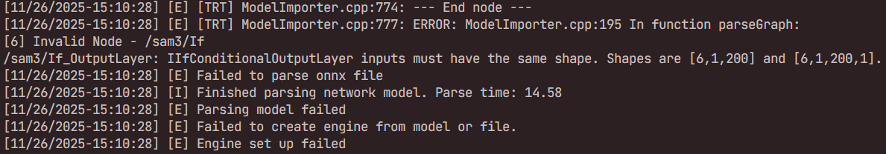

# sam3-onnxruntime

Sam3 的 ONNX 导出与推理示例。包含模型导出、ONNXRuntime 推理，以及 TensorRT 引擎导出的必要修正。

## 环境与依赖
- Python ≥ 3.9；可选 GPU（ONNXRuntime CUDA）。
- 安装依赖：
  ```bash
  pip install -U torch transformers onnxruntime onnx opencv-python regex
  # 其余参考 https://huggingface.co/facebook/sam3
  ```
- 模型与处理器需位于 `models/`：`Sam3Model.from_pretrained("models")`、`Sam3Processor.from_pretrained("models")`。
- 文本词表：`models/vocab.json`、`models/merges.txt`。

## 目录结构
- `onnx_export/`：
  - `export_detect_onnx.py`（导出 ONNX）
  - `test_onnx.py`（验证输出形状）
  - `zidane.jpg`（示例图片）
- `onnx_detect/`：
  - `onnx_detect.py`（推理入口）
  - `image_preprocess.py`（图像预处理到 `NCHW` 与 `1008×1008`）
  - `simplify_tokenizer.py`（纯 Python CLIP BPE，生成 `input_ids/attention_mask`）
  - `detect_postprocess.py`（分数筛选、掩码与框可视化）
- `onnx2engine/`：
  - `modify_onnx.py`（修正分支图，给 `Squeeze` 输出补 `Unsqueeze`，生成 4D 输出）
  - `onnx2engine.sh`（使用 `trtexec` 导出 TensorRT engine）
- `models/`：放置 Sam3 权重与处理器、词表文件，以及导出的 `onnx_detect/sam3.onnx`。

## 快速开始
0. 下面模型文件
   ```bash
    通过网盘分享的文件：models
    链接: https://pan.baidu.com/s/1gjDnG8_9FKMxtU-EQI_GhA 提取码: 1pn6 
    --来自百度网盘超级会员v4的分享
   ```

1. 导出 ONNX（生成 `models/onnx_detect/sam3.onnx`）
   ```bash
   python onnx_export/export_detect_onnx.py
   ```
2. 运行 ONNX 推理（生成 `vis.png`）
   ```bash
   python onnx_detect/onnx_detect.py
   ```
3. 修正 ONNX（生成 `models/onnx_detect_modify/sam3.onnx`）

   直接onnx转engine可能报错，需要修正onnx模型

   
   
   ```bash
   python onnx2engine/modify_onnx.py
   ```
4. 导出 TensorRT engine（需本机安装 TensorRT 与 `trtexec`）
   ```bash
   bash onnx2engine/onnx2engine.sh
   ```

## 说明与建议
- 导出 ONNX：`onnx_export/export_detect_onnx.py` 会封装 `Sam3Model` 为三路输出，并用 ONNXRuntime 打印 I/O 形状。
- onnx模型大于2GB，需要分多个chunk导出, 指定 `external_data=True`。
- 推理流程：图像预处理 + 文本编码 → ORT 推理 → 后处理与可视化输出 `vis.png`。
- TensorRT 导出注意：直接对原始 ONNX 导出 engine 可能失败；必须先运行 `onnx_export/export_detect_onnx.py` 生成 ONNX，并通过 `onnx2engine/modify_onnx.py` 修正后再导出。

## C++ 推理编译

本项目提供了基于 C++ 和 TensorRT 的推理实现。

### 1. 环境准备
确保已安装以下依赖：
- XMake
- TensorRT
- CUDA / cuDNN
- OpenCV

### 2. 配置路径
在编译前，请打开 `cpp_src/xmake.lua` 文件，并根据您的环境修改文件顶部的 TensorRT 和 cuDNN 路径配置：

```lua
local trt_include_dir   = "/path/to/TensorRT/include"
local trt_lib_dir       = "/path/to/TensorRT/lib"
local cudnn_include_dir = "/path/to/cudnn/include"
local cudnn_lib_dir     = "/path/to/cudnn/lib"
```

### 3. 编译与运行
进入 `cpp_src` 目录并使用 xmake 进行编译：

```bash
cd cpp_src
xmake
```

编译完成后，可以直接运行：

```bash
xmake run
```

## 参考仓库
   - [facebook/sam3](https://huggingface.co/facebook/sam3)
   - [skane1024/transformer_CLIPTokenizer_cpp_implement](https://github.com/skane1024/transformer_CLIPTokenizer_cpp_implement/tree/main)
   - [facebook/sam3](https://huggingface.co/facebook/sam3)
   - [dataplayer12/SAM3-TensorRT](https://github.com/dataplayer12/SAM3-TensorRT/tree/main)
  
## 致谢
感谢 [naonao-cola](https://github.com/naonao-cola) 提供 C++ 代码。
